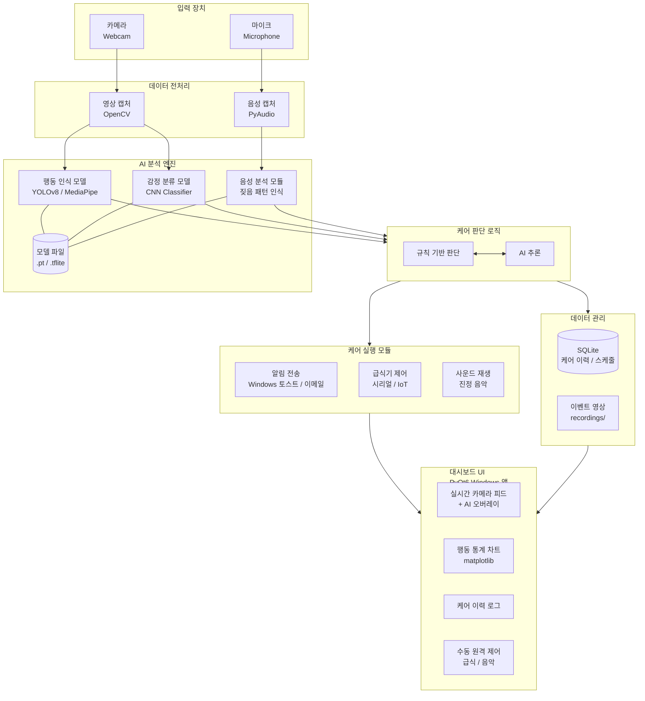
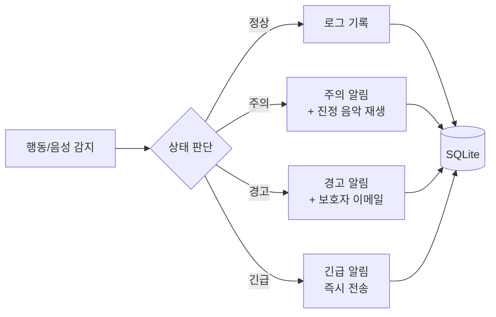
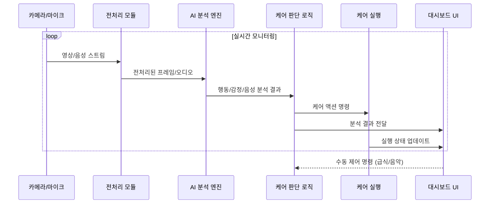

# AI 기반 반응형 Dog Care 시스템 - 시스템 블록도

```mermaid
flowchart TB
    subgraph INPUT["입력 장치"]
        I1[카메라\nWebcam]
        I2[마이크\nMicrophone]
    end

    subgraph PREPROCESS["데이터 전처리"]
        P1[영상 캡처\nOpenCV]
        P2[음성 캡처\nPyAudio]
    end

    subgraph AI["AI 분석 엔진"]
        direction TB
        A1[행동 인식 모델\nYOLOv8 / MediaPipe]
        A2[감정 분류 모델\nCNN Classifier]
        A3[음성 분석 모듈\n짖음 패턴 인식]
        A4[(모델 파일\n.pt / .tflite)]
        A1 & A2 & A3 --- A4
    end

    subgraph CARE["케어 판단 로직"]
        direction LR
        C1[규칙 기반 판단]
        C2[AI 추론]
        C1 <--> C2
    end

    subgraph ACTION["케어 실행 모듈"]
        direction TB
        AC1[알림 전송\nWindows 토스트 / 이메일]
        AC2[급식기 제어\n시리얼 / IoT]
        AC3[사운드 재생\n진정 음악]
    end

    subgraph UI["대시보드 UI\nPyQt6 Windows 앱"]
        direction LR
        U1[실시간 카메라 피드\n+ AI 오버레이]
        U2[행동 통계 차트\nmatplotlib]
        U3[케어 이력 로그]
        U4[수동 원격 제어\n급식 / 음악]
    end

    subgraph DB["데이터 관리"]
        D1[(SQLite\n케어 이력 / 스케줄)]
        D2[이벤트 영상\nrecordings/]
    end

    I1 --> P1
    I2 --> P2
    P1 --> A1 & A2
    P2 --> A3
    A1 & A2 & A3 --> CARE
    CARE --> ACTION
    CARE --> DB
    ACTION --> UI
    DB --> UI
```

---

## 알림 등급 흐름

```mermaid
flowchart LR
    DETECT[행동/음성 감지] --> JUDGE{상태 판단}

    JUDGE -->|정상| LOG[로그 기록]
    JUDGE -->|주의| WARN[주의 알림\n+ 진정 음악 재생]
    JUDGE -->|경고| ALERT[경고 알림\n+ 보호자 이메일]
    JUDGE -->|긴급| URGENT[긴급 알림\n즉시 전송]

    LOG --> DB2[(SQLite)]
    WARN --> DB2
    ALERT --> DB2
    URGENT --> DB2
```

---

## AI 분석 데이터 흐름

```mermaid
sequenceDiagram
    participant CAM as 카메라/마이크
    participant PRE as 전처리 모듈
    participant AI as AI 분석 엔진
    participant CARE as 케어 판단 로직
    participant ACTION as 케어 실행
    participant UI as 대시보드 UI

    loop 실시간 모니터링
        CAM->>PRE: 영상/음성 스트림
        PRE->>AI: 전처리된 프레임/오디오
        AI->>CARE: 행동/감정/음성 분석 결과
        CARE->>ACTION: 케어 액션 명령
        CARE->>UI: 분석 결과 전달
        ACTION->>UI: 실행 상태 업데이트
    end

    UI-->>CARE: 수동 제어 명령 (급식/음악)
```
