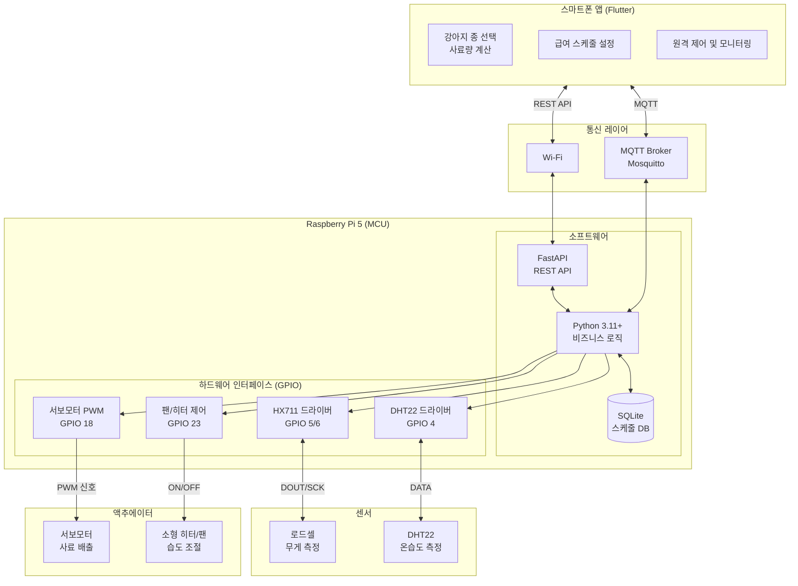
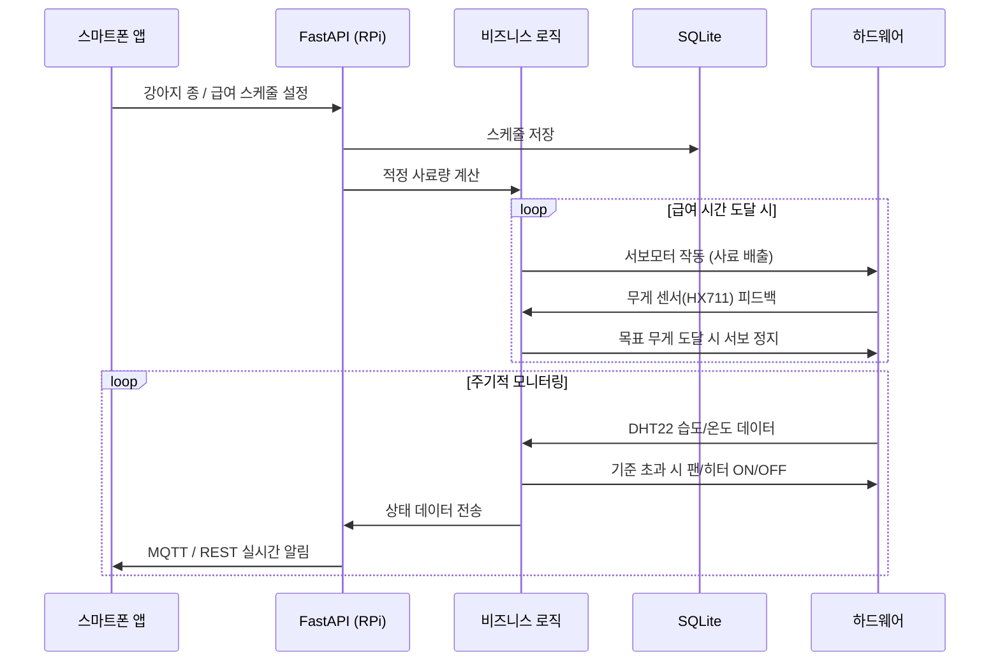

# 스마트 자동 애완사료분배기 - 시스템 블록도

```mermaid
flowchart TB
    subgraph APP["스마트폰 앱 (Flutter)"]
        direction TB
        A1[강아지 종 선택\n사료량 계산]
        A2[급여 스케줄 설정]
        A3[원격 제어 및 모니터링]
    end

    subgraph CLOUD["통신 레이어"]
        direction LR
        C1[Wi-Fi]
        C2[MQTT Broker\nMosquitto]
    end

    subgraph RPI["Raspberry Pi 5 (MCU)"]
        direction TB
        subgraph SW["소프트웨어"]
            direction LR
            S1[FastAPI\nREST API]
            S2[Python 3.11+\n비즈니스 로직]
            S3[(SQLite\n스케줄 DB)]
        end

        subgraph HW["하드웨어 인터페이스 (GPIO)"]
            direction LR
            H1[HX711 드라이버\nGPIO 5/6]
            H2[DHT22 드라이버\nGPIO 4]
            H3[서보모터 PWM\nGPIO 18]
            H4[팬/히터 제어\nGPIO 23]
        end

        S2 --> H1
        S2 --> H2
        S2 --> H3
        S2 --> H4
        S1 <--> S2
        S2 <--> S3
    end

    subgraph SENSORS["센서"]
        SE1[로드셀\n무게 측정]
        SE2[DHT22\n온습도 측정]
    end

    subgraph ACTUATORS["액추에이터"]
        AC1[서보모터\n사료 배출]
        AC2[소형 히터/팬\n습도 조절]
    end

    APP <-->|REST API| C1
    APP <-->|MQTT| C2
    C1 <--> S1
    C2 <--> S2

    H1 <-->|DOUT/SCK| SE1
    H2 <-->|DATA| SE2
    H3 -->|PWM 신호| AC1
    H4 -->|ON/OFF| AC2
```

## 데이터 흐름 요약

```mermaid
sequenceDiagram
    participant App as 스마트폰 앱
    participant API as FastAPI (RPi)
    participant Logic as 비즈니스 로직
    participant DB as SQLite
    participant HW as 하드웨어

    App->>API: 강아지 종 / 급여 스케줄 설정
    API->>DB: 스케줄 저장
    API->>Logic: 적정 사료량 계산

    loop 급여 시간 도달 시
        Logic->>HW: 서보모터 작동 (사료 배출)
        HW->>Logic: 무게 센서(HX711) 피드백
        Logic->>HW: 목표 무게 도달 시 서보 정지
    end

    loop 주기적 모니터링
        HW->>Logic: DHT22 습도/온도 데이터
        Logic->>HW: 기준 초과 시 팬/히터 ON/OFF
        Logic->>API: 상태 데이터 전송
        API->>App: MQTT / REST 실시간 알림
    end
```
