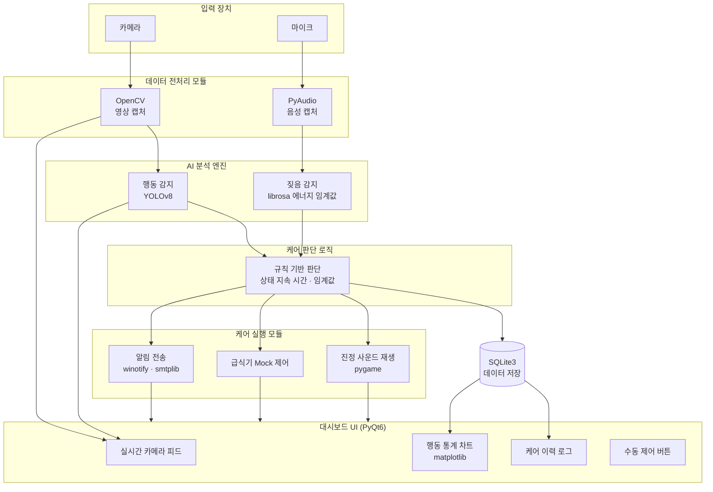
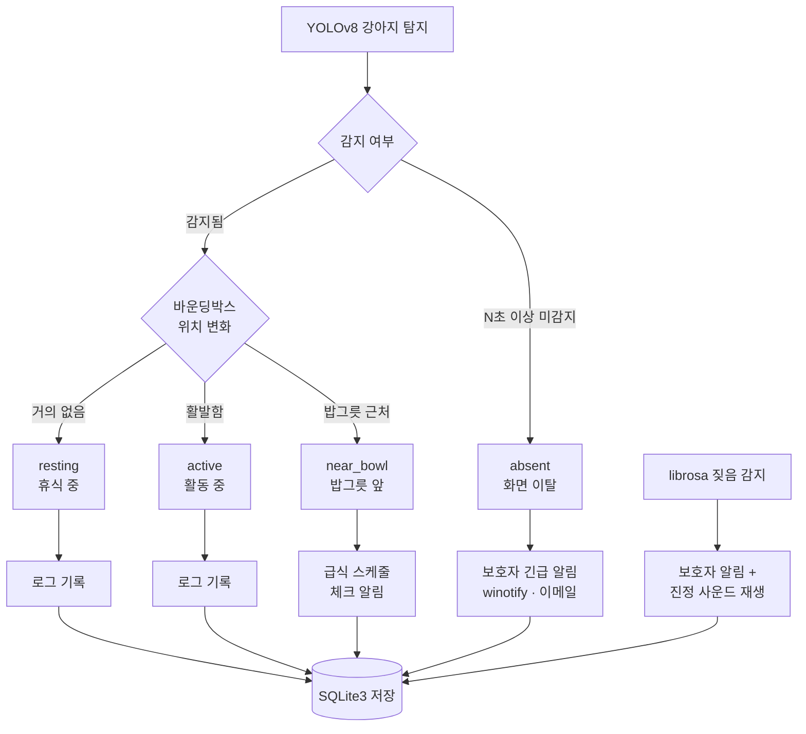
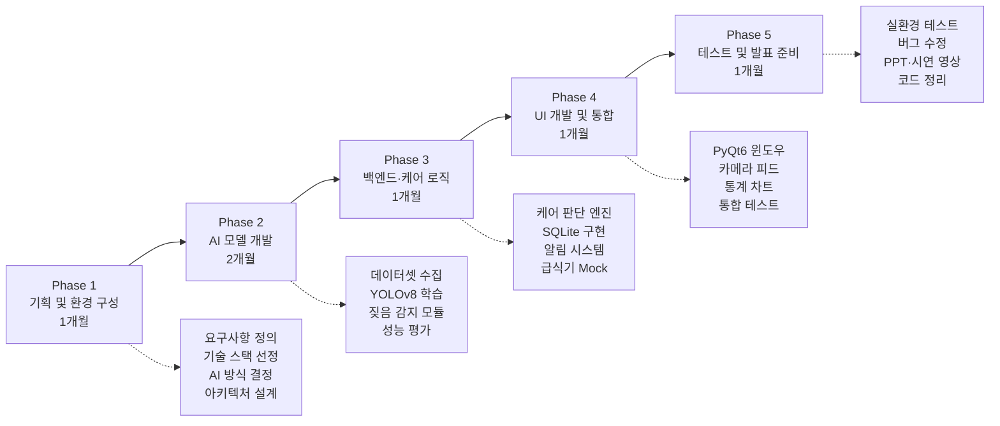
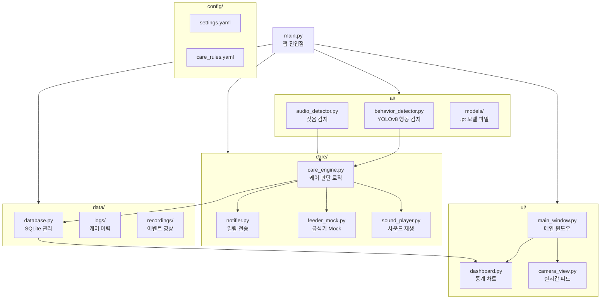

# 시스템 블록도 (diagram2)

project3.md 기반 Mermaid 다이어그램 모음

---

## 1. 시스템 전체 아키텍처



---

## 2. AI 학습 방식 선택 흐름도

```mermaid
flowchart TD
    START([AI 학습 방식 결정]) --> Q1{데이터 직접\n수집 가능?}

    Q1 -- 예 --> Q2{라벨링 시간\n확보 가능?}
    Q1 -- 아니오 --> OPT2

    Q2 -- 예 --> OPT1[Roboflow 직접 학습\n촬영 → 라벨링 → YOLOv8 학습]
    Q2 -- 아니오 --> OPT2[Roboflow Universe\n사전학습 모델 fine-tuning]

    OPT1 --> ADV1["장점: 커스텀 모델\n졸업작품 완성도 높음"]
    OPT1 --> DIS1["단점: 데이터 수집·라벨링\n시간 소요"]

    OPT2 --> ADV2["장점: 빠른 시작\n데이터 수집 불필요"]
    OPT2 --> DIS2["단점: 라벨 카테고리\n추가 조정 필요"]

    Q1 -- 비용 허용 --> OPT3[Vision LLM API\nGPT-4o 또는 Claude API]
    OPT3 --> ADV3["장점: 추가 학습 불필요\n구현 간단"]
    OPT3 --> DIS3["단점: API 비용 발생\n실시간 속도 제한 1~2 FPS"]

    ADV1 & ADV2 & ADV3 --> EXPORT[YOLOv8 모델 (.pt) 내보내기]
    DIS1 & DIS2 & DIS3 --> EXPORT
    EXPORT --> DEPLOY[behavior_detector.py 에 적용]
```

---

## 3. 행동 상태별 케어 흐름도



---

## 4. 개발 단계 (Phase) 흐름도



---

## 5. 모듈 구성도 (디렉토리 기반)


