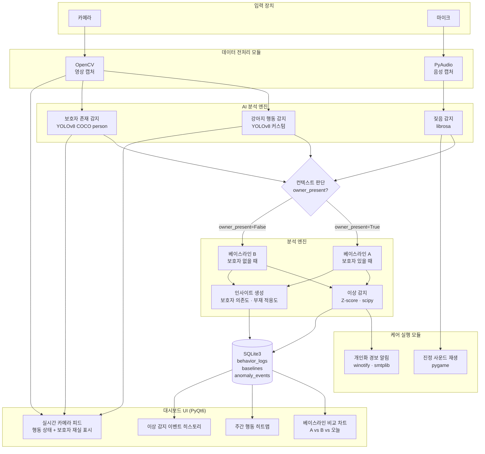
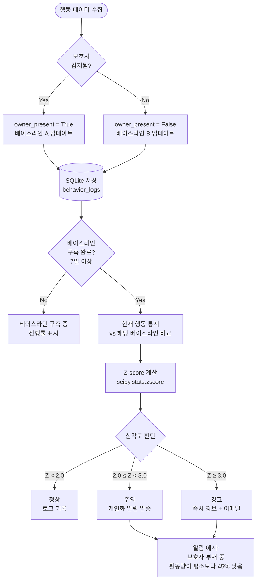
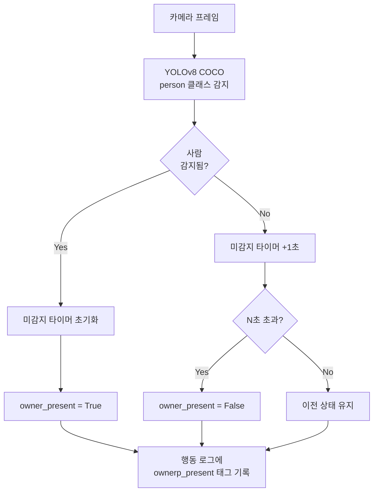
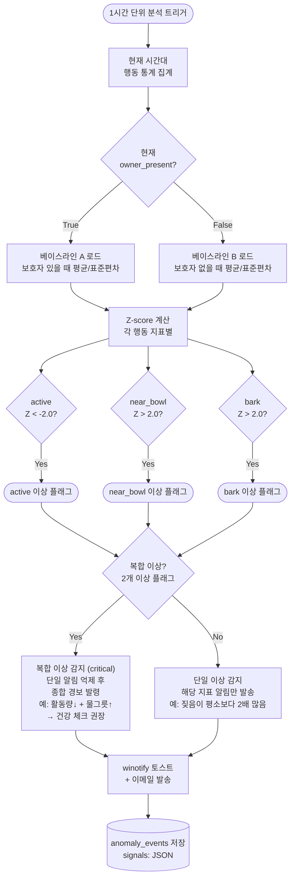
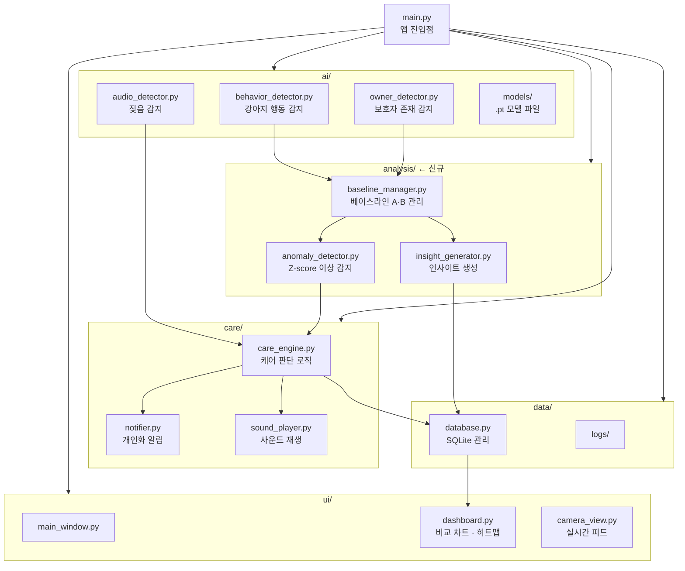
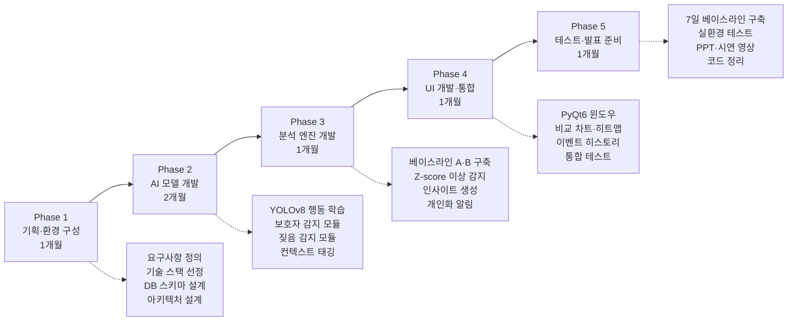

# 시스템 블록도 (diagram3)

project4.md 기반 Mermaid 다이어그램 모음

---

## 1. 시스템 전체 아키텍처

---

## 2. 컨텍스트 인식 베이스라인 흐름도

---

## 3. 보호자 존재 감지 흐름도

---

## 4. 이상 감지 및 알림 흐름도

---

## 5. 모듈 구성도

---

## 6. 개발 단계 (Phase) 흐름도

